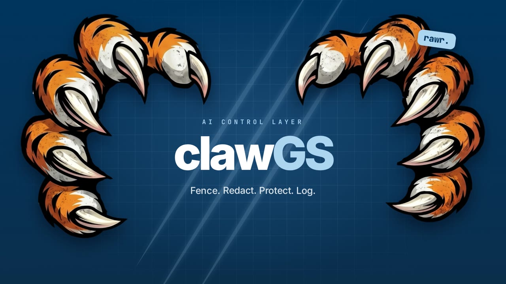

# clawGS — wideo promocyjne



**Gotowy plik:** [`clawGS-promo.mp4`](clawGS-promo.mp4): 1920×1080, 30 fps, 66,6 s, H.264, bez dźwięku.

Wideo to strona HTML animowana osią czasu GSAP. Skrypt `render.mjs` przewija ją klatka po klatce
w headless Chromium (Playwright) i koduje wynik ffmpegiem. Każdy render daje identyczny wynik,
więc zmiana jednego napisu to tylko edycja tekstu i ponowny render.

## Paleta (Goldman Sachs)

| | | | | | |
|---|---|---|---|---|---|
| `#7399C6` GS blue | `#00355F` navy | `#ACD4F1` sky | `#231F20` ink | `#58575A` gray | `#FFFFFF` white |

Wszystkie elementy UI korzystają wyłącznie z tych kolorów i ich mieszanek. Wyjątkiem są pazury
(`assets/claws.svg`), które celowo zostały w oryginalnych kolorach.
Kod wizualny dla „zablokowane” to rysy pazurów, a nie czerwień.

## Scenariusz

| Czas | Scena | Co pokazuje |
|---|---|---|
| 0:00–0:06 | Intro | Rysy pazurów rozdzierają ekran, łapy wpadają z boków, logo clawGS, naklejka „rawr.” |
| 0:06–0:12 | Problem | Agent AI połączony ze wszystkim + zagrożenia (prompt injection, PII, jailbreaki…) → „Time to bring out the claws.” |
| 0:12–0:18 | 01 Drop-in gateway | Podmiana `base_url` na żywo; OpenAI / Anthropic / Gemini / SSE / modele lokalne |
| 0:18–0:31 | 02 Hybrid guardrails | Pipeline: regex → keywords → decision model (AI) → LLM → output scan; 4 requesty: allow, PII, „grandma jailbreak” złapany przez model AI, wyciek klucza AWS w odpowiedzi |
| 0:31–0:36 | 03 Block responses | Ta sama odmowa w natywnym formacie OpenAI, Anthropic i Gemini |
| 0:36–0:42 | 04 MCP firewall | Whitelist narzędzi + polityka MCP pre-flight (`delete_repo`, `~/.ssh/id_rsa`) |
| 0:42–0:48 | 05 Budżety i rate limit | Budżet klucza dobija do limitu → `BLOCK_BUDGET`; 61. request w minucie → `BLOCK_RATE_LIMIT` |
| 0:48–0:56 | 06 Raportowanie | Dashboard, live audit, szczegóły requestu z ocenami polityk, webhook |
| 0:56–1:02 | 07 Standard | 8 kafelków: Models, MCP Servers, Provider Keys, Users, SSO Providers, Webhooks, System Audit, Data Export |
| 1:02–1:07 | Outro | Pazury wracają: „The AI control layer with claws.” |

## Uruchomienie

Potrzebne: Node 20+, ffmpeg w `PATH`.

```bash
cd video
npm install
npx playwright install chromium   # jednorazowo (albo ustaw CHROMIUM_PATH na istniejący Chrome/Chromium)

npm run preview                   # podgląd na żywo: http://127.0.0.1:5173
npm run render                    # pełny render → clawGS-promo.mp4 (~9 min na 4 rdzeniach)
```

Podgląd w przeglądarce: spacja = pauza, ←/→ = ±1 s (z Shift ±5 s), `D` = licznik czasu, `R` = od początku.
Do konkretnego momentu skaczesz parametrem URL: `?t=24.5&debug`.

Przydatne opcje renderu:

```bash
node render.mjs --stills 3.5,24,52       # klatki PNG do out/stills/ (szybki podgląd zmian)
node render.mjs --from 18 --to 31 --out out/guardrails.mp4
node render.mjs --fps 60                 # płynniej, 2× dłużej
node render.mjs --audio muzyka.mp3       # podkład: przycięty do długości wideo, 2 s wyciszenia na końcu
```

## Edycja

- **Teksty:** wszystkie napisy są w [`src/copy.js`](src/copy.js). Fragment w `<em>` jest podświetlany na niebiesko.
  Tłumaczenie na polski to tylko edycja tego pliku. Fonty zawierają polskie znaki.
- **Sceny i timing:** [`src/scenes.js`](src/scenes.js) (jedna funkcja na scenę), kolejność i przejścia
  w [`src/main.js`](src/main.js).
- **Pazury:** `assets/claws.svg` (oryginał) i `assets/claws.png` (przezroczysty render używany w animacji,
  lewa i prawa łapa są wycinane z tego samego obrazka).

Liczby na dashboardzie i w przykładach (koszty, liczniki, latencje) są ilustracyjne.

## Licencje zależności

GSAP 3.15 (darmowa licencja GSAP, w tym pluginy TextPlugin, ScrambleText i DrawSVG), fonty Inter
i JetBrains Mono (OFL, z `@fontsource-variable`), ikony Lucide (ISC, wklejone do `src/icons.js`).
